## 2.1正则表达式

SIR ANDREW: Her C’s, her U’s and her T’s: why that?

莎士比亚《第十二夜》

&emsp;&emsp;正则表达式(RE)是在计算机科学标准化方面一个默默无闻的成功例子，它是一种用于指定文本搜索字符串的语言。这种实用语言用于各种计算机语言，文字处理器和文本处理工具等，如Unix工具grep或Emacs。在形式上，正则表达式是表示一组字符串的代数符号。当我们有一个模式要搜索和有一个语料库要搜索时，它在文本搜索中特别有用。正则表达式搜索函数将在语料库中搜索，返回与模式匹配的所有文本。语料库可以是单个文档，也可以是一个集合。例如，Unix命令行工具grep接受一个正则表达式，并返回与该模式匹配的输入文档的每一行。
&emsp;&emsp;搜索可以设计为返回一行中的每一个匹配项(如果有多个匹配项)，或者只返回第一个匹配项。在下面的示例中，我们通常在模式中与正则表达式匹配的部分加下划线，并仅显示第一个匹配项，我们将展示由斜杠分隔的正则表达式，但请注意斜杠不是正则表达式的一部分。
&emsp;&emsp;正则表达式有许多变体。我们将描述扩展正则表达式；不同的正则表达式解析器可能只识别这些模式的子集，或者对某些模式的处理略有不同。使用一个在线的正则表达式测试器是测试您的模式和探索这些变化的一种方便的方法。

### 2.1.1 基本正则表达式

&emsp;&emsp;最简单的正则表达式是一系列简单字符。要搜索*woodchuck*，我们输入**/woodchuck/ **。模式**/Buttercup/ **可以匹配任何包含子字符串*Buttercup*的字符串，grep时用这个模式（**/Buttercup/ **）会返回一行，*I’m called little Buttercup*。搜索字符串可以由单个字符（比如**/!/ **）或字符序列（比如**/urgl/ **）组成。
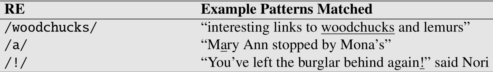
**表2.1** 一些简单的正则表达式搜索

&emsp;&emsp;正则表达式**区分大小写**；小写字母**/s/ **与大写字母**/S/ **不同（**/s/ **匹配小写字母*s*，但不匹配大写字母*S*）。这意味着模式**/woodchucks/ **将不匹配字符串*Woodchucks*。我们可以用方括号**[and]**来解决这个问题。方括号内的字符串指定要匹配的一个字符。表2.2展示了模式**/[wW]/ **匹配包含*w*或*W*的模式。
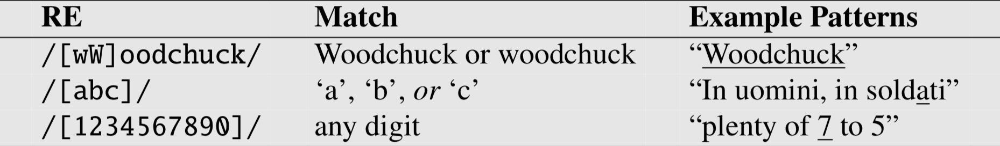
**表2.2** 使用括号[]指定字符的析取

&emsp;&emsp;正则表达式**/[1234567890]/ **指定其中任意单个数字。虽然数字或字母之类的字符是模式中的重要构建部分，但是它们可能会变得很笨拙（例如，将**/[ABCDEFGHIJKLMNOPQRSTUVWXYZ]/ **指定为“任意大写字母”不太方便）。如果有明确定义的序列与一组字符相关联，方括号可以与短划线**(-) **一起用于指定范围内的任何一个字符。模式**/[2-5]/ **指定字符*2,3,4,5*中的任何一个。模式**/[b-g]/ **指定字符*b、c、d、e、f、g*中的任意一个。其他一些示例如表2.3所示。
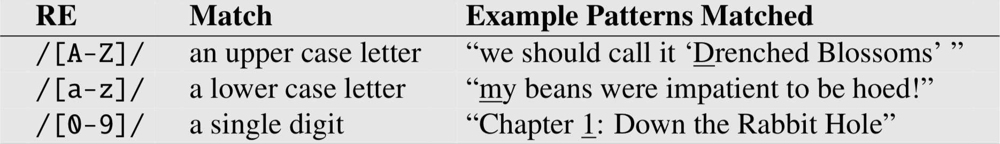
**表2.3** 使用方括号[]加上  -  来指定范围。

&emsp;&emsp;通过使用\^符号，方括号也可用于指定单个字符不能是什么。如果符号\^是方括号后的第一个符号，则这个正则表达式的判定结果就是否定的。例如，模式**/ [\^a] / **匹配除a之外的任何单个字符（包括特殊字符）。只有当符号\^是方括号后的第一个符号时才会出现这种情况，如果它出现在其他地方，它通常代表一个符号\^；表2.4展示了一些例子。
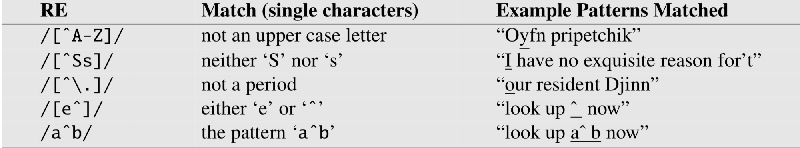
**表2.4**  \^表示否定或仅表示符号\^，参见下面的re: 用于转义的反斜杠。

&emsp;&emsp;我们该如何讨论可选元素呢？比如*woodchuck*和*woodchucks*中的可选s。我们不能使用方括号，因为虽然它允许我们说“*s*或*S*”，但它们不允许我们说“s or nothing”。为此，我们使用问号**/?/ **，表示“前一个字符有或者没有”，如表2.5所示。
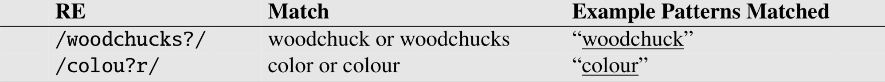
**表2.5**  问号 “?“” 标记前一个模式的可选性。

&emsp;&emsp;我们可以把问号 ? 看作是“前一个字符的零个或一个实例”。也就是说，它是一种指定我们需要多少个数的方法，这在正则表达式中非常重要。例如，考虑某些sheep的语言（**原文：the language of certain sheep**），它由如下字符串组成:
      baa!
​      baaa!
​      baaaa!
​      baaaaa!
​      ...
&emsp;&emsp;该语言由带有b的字符串组成，后跟至少两个a，后跟一个感叹号。一组运算符允许我们说“一些a的数字”是基于星号或\*，通常称为 \*\[Kleene](一般读作"cleany star")，Kleene\*表示“前一个字符或正则表达式出现零次或多次”。所以**/a\*/ **的意思是“任何0或多个a的字符串”。这将匹配*a*或*aaaaaa*，但它也将匹配*Off Minor*，因为字符串*Off Minor*没有a。所以匹配一个或多个a的正则表达式是**/aa*/ **，意思是一个a后面跟0个或多个a，也可以重复更复杂的模式。所以**/[ab]\*/ **的意思是“0或多个a或b”(而不是“0或多个右方括号”)。这将匹配像*aaaa*或*ababab*或*bbbb*这样的字符串。
&emsp;&emsp;对于指定多个数字(对于查找价格很有用)，我们可以扩展/[0-9]/，这是一个数字的正则表达式。因此，整数（一串数字）是**/[0-9] [0-9]\*/ **。 （那为什么不是**/ [0-9] \* / ** ）

&emsp;&emsp;有时不得不为数字编写两次正则表达式是很烦人的，所以有一种更短的方法来指定“至少一个”某些字符。这是Kleene +，意思是“紧接在前面的字符或正则表达式出现一次或多次”。因此，模式**/[0-9]+/ **是指定“数字序列”的常用方法。因此，有两种方法可以指定sheep语言：**/baaa\*!/ **  **/ baa+! / **。
&emsp;&emsp;一个非常重要的特殊字符是句点(**/./ **)，它是一个通配符模式，可以匹配任何单个字符（除了回车），如表2.6所示。
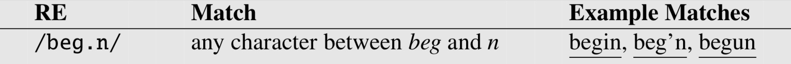
**表2.6**  使用句号  。指定任何字符

&emsp;&emsp;通配符通常与Kleene星号(\*)一起使用，表示“任意字符串”。例如，假设我们想要找到特定单词（例如，*aardvark*）出现两次的任何行。我们可以使用正则表达式**/aardvark.\*aardvark/ **来指定它。**Anchors**是将正则表达式锚定到字符串中特定位置的特殊字符。最常见的**Anchors**是符号\^和美元符号\$，符号\^匹配行的开头，模式
**/\^The/ **只匹配单词*The*出现在行首的行。
因此，符号\^有三个用途：匹配一行的开头；表示方括号内的否定；仅表示符号\^。美元符号 \$ 匹配行的结尾（允许grep或Python知道给定插入符应该具有哪个函数的上下文是什么？）。所以模式**/␣$/ **是一个很有用的匹配一行以空格结尾的模式，**/\^The dog\\.$/ **匹配只包含短语*The dog*的行。(我们必须在这里使用反斜杠，因为我们想要  .  表示“句号”，而不是通配符。)

&emsp;&emsp;还有其他两个**Anchors **：**\b **匹配单词边界，**\B **匹配非边界。因此，**/\bthe\b/ **匹配单词*the*，但不匹配单词*other*。更严格地说，用于正则表达式的“word”定义为任何数字、下划线或字母序列；这是基于编程语言中“word”的定义。例如，**/\b99\b/ **将会在句子*There are 99 bottle of beer on the wall*中匹配到字符串99 (因为99跟在空格后面)，而不会在句子*There are 299 bottle of beer on the wall*中匹配到99 (因为99跟在一个数字后面)。但是它将在**\$99 **中匹配99(因为99后面有一个美元符号(\$)，\$不是数字、下划线或字母)。

### 2.1.2 提取、分组和优先级

&emsp;&emsp;假设我们需要搜索关于宠物的文本;也许我们对猫和狗特别感兴趣。在这种情况下，我们可能想要搜索字符串*cat*或字符串*dog*。由于不能使用方括号搜索“cat或dog”(为什么不能输入**/[catdog]/?**)，因此需要一个新的操作符，析取操作符，也称为管道符号|。模式**/cat|dog/ **匹配字符串*cat*或字符串*dog*。有时我们需要在更长的序列中使用这个析取运算符。例如，假设我想为我的表弟大卫搜索有关宠物鱼的信息。如何同时指定*guppy*和*guppies*?我们不能简单地说**/guppy|ies/ **，因为它只匹配字符串*guppy*或*ies*。这是因为像*guppy*这样的序列优先于析取操作符|。要使析取运算符仅应用于特定的模式，我们需要使用圆括号运算符 ( and ) 。将一个模式括在圆括号中使其充当单个字符，用于邻近的操作符，如管道符号|和Kleene \*。所以模式**/ gupp(y|ies)/ **会指定我们的意思是仅仅应用于后缀y和ies的分离。
&emsp;&emsp;圆括号操作符 ( 在使用类似Kleene \*的计数器时也很有用。与 | 操作符不同，Kleene \*操作符默认情况下只应用于单个字符，而不是整个序列。假设我们想匹配字符串的重复实例。也许我们有一行具有列标签的形式*Column 1 Column 2 Column 3*。模式**/Column␣[0-9] +␣\* / **将不匹配任意数量的列；相反，它将匹配单个列，后跟任意数量的空格！这里的 \* 仅适用于它之前的空格␣，而不适用于整个序列。使用括号，我们可以编写模式**/(Column␣[0-9] +␣\*)\* / **以匹配单词*Column*，后跟数字和可选空格，整个模式重复任意次。
&emsp;&emsp;一个运算符可能优先于另一个运算符，这要求我们有时使用括号来指定我们的意思，这种思想由正则表达式的运算符优先层次结构表现出来的。下表给出了RE操作符优先级的顺序，从最高优先级到最低优先级。

&emsp;&emsp;因此，因为计数器具有比序列更高的优先级，所以**/\***匹配*theeeee*而不匹配*theee*。因为序列有比析取更高的优先级，**/the|any/ **匹配*the* 或者*any*但不匹配*theny*。
&emsp;&emsp;模式在另一种情况下可能是模糊的。想想正则表达式**/[a-z]\*/ **在匹配文本 *once upon a time*时，**/[a-z]\*/ **匹配0个或多个字母，这个模式匹配不到字符，或者只匹配第一个字母*o、on、onc*或*once*。在这些情况下，正则表达式总是尽可能匹配最长的字符串；我们说它是贪婪的，扩展到尽可能多地覆盖字符串。
&emsp;&emsp;然而，有一些方法可以强制非贪婪匹配，使用?限定符。操作符 **\*?** 是一个Kleene \*，匹配到尽可能少的文本，操作符**+?**尽可能少的匹配文本。

### 2.1.3 一个简单的例子

&emsp;&emsp;假设我们想写一个正则表达式来查找英文文章中*the*的例子。一个简单（但不正确）的模式可能是：
**/the/ **
&emsp;&emsp;一个问题是：如果这个词在句首时会大写首字母（即，*The*）这个模式就错了，这可能会导致我们采用以下模式：
**/[tT]he/ **
&emsp;&emsp;但是我们仍然会错误地返回带有嵌入式的文本（例如，*other*或**theology**）。所以我们需要指定我们想要在两边都有单词边界的实例：

**/\b[tT]he\b/ **

&emsp;&emsp;假设我们想在不使用**/\b/ **的情况下完成此操作。我们可能希望这样，因为   **/\b/ **不会将下划线和数字作为单词边界;但我们可能希望在某些上下文中找到*the*，它附近也可能有下划线或数字（*the*或*he25* ）。我们需要指定我们想要的实例，*the*两侧都没有字母：

**/\[\^a-zA-Z][tT]he[\^a-zA-Z]/ **

&emsp;&emsp;但这种模式还有一个问题：它在开始一行时找不到单词*the*。这是因为这个正则表达式 **[\^a-zA-Z]**，我们使用它来避免嵌入的实例，也意味着必须有一些单个(尽管不是字母)字符在。我们可以通过在我们要求在*the*前并在行的开头或非字母字符之前指定，以及在行的末尾指定，来避免这种情况：

**/(\^|[\^a-zA-Z])[tT]he([\^a-zA-Z]|\$)/ **

&emsp;&emsp;我们刚刚经历的过程是基于修复两种错误：误报（*false positives*），我们错误匹配的字符串，如*other* 或 *there*，以及漏报（*false negatives*），我们错误错过的字符串，如*The*。在实现语音和语言处理系统的过程中，这两种错误的处理会反复出现。因此，降低应用程序的总体错误率需要两个方面的努力：

- 提高精确度（最大限度地减少误报）
- 提高召回率（最大限度地减少漏报）
### 2.1.4 更复杂的例子
&emsp;&emsp;让我们尝试一个更重要的例子来说明正则表达式的威力。假设我们要构建一个应用程序来帮助用户在网上购买计算机。用户可能想要“处理器速度至少6GHz，硬盘500GB，并且价格低于\$1000的机器”，进行这种检索，我们首先需要能够查找像 *6GHz*或*500 GB *或 *Mac* 或 *\$999.99*这样的表达式，在本节的剩下部分，我们将为这个任务设计一些简单的正则表达式。
&emsp;&emsp;首先，让我们完成价格的正则表达式。下面是一个美元符号后面跟着一串数字的正则表达式:

**/$[0-9]+/ **

&emsp;&emsp;注意，\$符在这里的功能与我们前面讨论的在行尾的功能不同。大多数正则表达式解析器足够聪明，可以意识到\$z在这里并不指行尾。（做一个思考实验，想一下正则表达式解析器如何从上下文中确定\$的功能。）

**/$[0-9]+**
**\\.\[0-9]\[0-9]/ **

&emsp;&emsp;这个模式只允许*\$199.99*而不允许*\$199*，我们需要使*美分*（美元小数点后的数字）可选，并且确保处于一个单词边界：

**/(\^|\W)\$\[0-9]+(\\.\[0-9]\[0-9])?\b/ **

&emsp;&emsp;最后一招！这种模式允许像*\$199999.99*这样的价格，这太贵了!我们需要限制价格：

**/(\^|\W)\$\[0-9]{0,3}\(\\.\[0-9]\[0-9])?\b/ **

&emsp;&emsp;大于6GHz处理器速度的规格怎么样？这样的模式是：

**/\b\[6-9]+␣\*\(GHz|\[Gg]igahertz)\b/ **

&emsp;&emsp;请注意，我们使用**/␣\*/ **表示“零个或多个空格”，因为周围可能总是有多余的空格。对于硬盘空间，我们需要再次允许可选的小数部分(*5.5 GB*);注意 问号**?** 是为了使最后的  **s**  选项可选:

**/\b\[0-9]+\(\\.\[0-9]+)?␣\*\(GB|\[Gg]igabytes?)\b/ **

&emsp;&emsp;修改这个正则表达式，使其只匹配超过500GB，这留给读者作为练习。

### 2.1.5 更多操作符

&emsp;&emsp;表2.7展示了一些常见范围的别名，这些别名主要用于节省输入。除了Kleene \* 和Kleene \+ 我们也可用一对大括号包着具体的数字作为计数器。正则表达式**/{3}/ **的意思是“前一个字符或表达式恰好出现3次”。因此**/a\\.{24}z/ **将匹配  *a*  后跟24个点（\.）后跟  *z*  （但不是  *a*  后跟23或25点(\.)后跟(  *z*  )）。
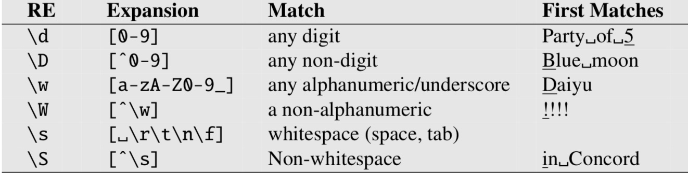
**表2.7**  常用字符集的别名

&emsp;&emsp;还可以指定一个数字范围。因此**/\{n,m}/ **指定之前的字符或表达式出现n到m次。**/\{n,}/ **意思是之前的式子至少出现n次。表2.8统计的是正则表达式的计数。
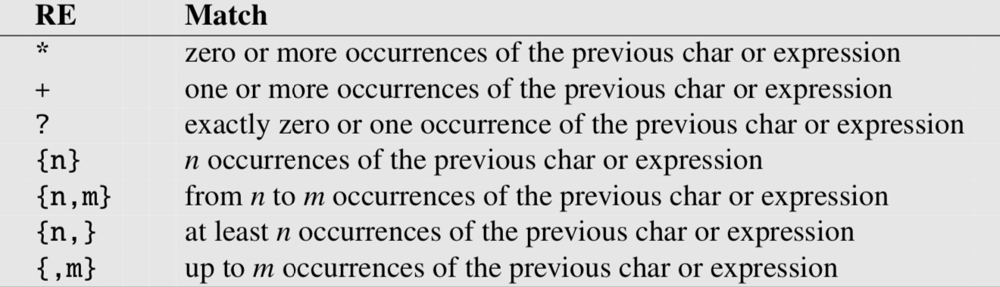
**表2.8**  用于计数的正则表达式运算符

&emsp;&emsp;最后，通过基于反斜杠(\\)符号来引用某些特殊字符（见表2.9）。其中最常见的是换行符**\\n**和制表符**\\t**。要引用自身特殊的字符（如  . ， \*，  [，  \\，），请在它们前面加上反斜杠（即**/\\./ **，**/\\\* / **，  **/ \\ [ / **  和  **/ \\\ / **） 。
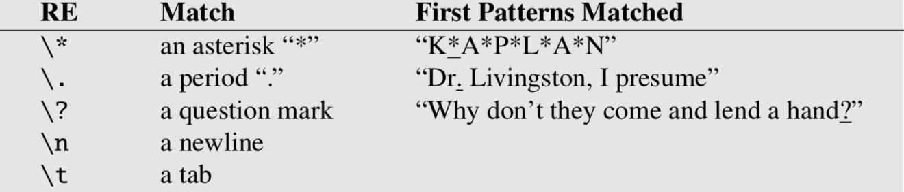
**图2.9**  一些字符需要反斜杠转义

### 2.1.6 正则表达式替换、获取组和ELIZA

&emsp;&emsp;正则表达式的一个重要用途是替换。例如，Python和Unix命令（如vim或sed）中使用的替换运算符**s/regexp1/pattern/ **允许以正则表达式格式的字符串替换为另一个字符串：
**s/colour/color/ **
&emsp;&emsp;能够用前一个正则表达式匹配到后一个字符串的一部分字符通常很实用。例如，假设我们想在文本中的所有整数周围加上尖括号，例如，将*the 35 boxes*更改为*the <35> boxes*。我们想要一种方法来引用我们找到的整数，以便我们可以轻松添加括号。为此，我们在第一个正则表达式周围加上括号（  和  ），并在第二个正则表达式中使用数字运算符** \1 **进行引用。它是这样的:

**s/(\[0-9]+)/<\1>/ **

&emsp;&emsp;圆括号和数字运算符还可以指定某个字符串或表达式必须在文本中出现两次。举个例子，假设我们在寻找这样一种模式“the Xer they were, the Xer they will be”，在这个模式中我们想要将两个X约束为一致。我们用尖括号操作符包围第一个*X*，并用数字操作符**\1 ** 替换第二个*X*，如下所示:

**/the (.\*)er they were, the \1er they will be/ **

这里\1将被与括号中的第一项匹配的字符串替换。我们现在就匹配句子 *the bigger they were, the bigger they will be* but not *the bigger they were, the faster they will be*。
&emsp;&emsp;使用括号将模式存储在内存中称为获取组。每次使用捕获组（即括号围绕一个正则表达式）时，产生的匹配都存储在编号的寄存器中。如果匹配两组不同的括号，\2表示匹配第二个捕获组的内容。这个正则式：

**/the (\.\*)er they (\.\*),  the \1er we \2/ **

&emsp;&emsp;将匹配到*he faster they ran, the faster we ran* but not *the faster they ran, the faster
we ate*。同样，第三个捕获组存储在\ 3中，第四个存储在\ 4中，依此类推。
&emsp;&emsp;因此，括号在正则表达式中具有两个功能：一、它们用于对术语进行分组，以指定操作符应用的顺序；二、用于在寄存器中捕获某些内容。有时，我们可能希望使用括号进行分组，但不希望在寄存器中捕获正则表达式。在这种情况下，我们使用一个非捕获组，它是通过在左括号后设置命令 **?:**  来指定的，形式为(  **?:正则表达式** )。下面这个表达式降匹配到*some cats like some cats* but not *some cats like some a few*.

**/(?:some|a few) (people|cats) like some \1/ **

&emsp;&emsp;替换和捕获组在实现像ELIZA（Weizenbaum，1966）这样的简单聊天机器人时非常有用。回想一下，**ELIZA**模仿了罗格学派的心理学家，进行了如下对话:
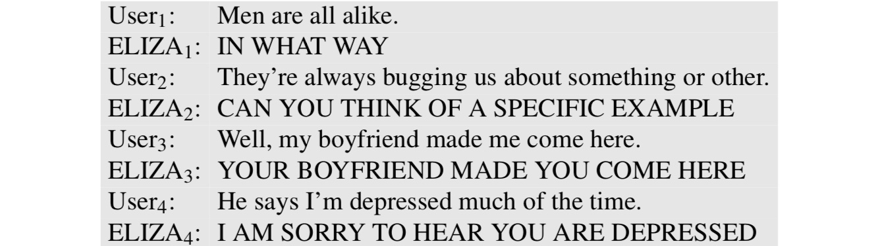
&emsp;&emsp;**ELIZA**的工作原理是使用一系列或级联的正则表达式替换每个替换匹配并更改输入行的某些部分。输入行首先是大写的。第一个替换是将*MY*的所有字符替换为*YOUR*，*I 'M 替换为 YOU ARE*，以此类推。下一组替换是查找并替换输入行中的其他正则表达式。这里有些例子：
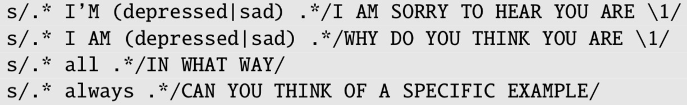
&emsp;&emsp;由于多个替换可以应用于给定的输入，所以将为替换分配一个秩并按顺序应用。创建正则表达式是练习2.3的主题，我们将在第24章回到ELIZA体系结构的细节。

### 2.1.7 断言（这一章请参考原文）
&emsp;&emsp;最后，有时我们需要预测未来：在文本中查看某些模式是否匹配，但不要提前匹配光标位置，这样我们就可以在模式出现时处理它。
&emsp;&emsp;这些前瞻性断言使用  **(?**  我们在前一节中看到的用于非捕获组的语法。如果出现正则表达式，则运算符**（？= pattern）**为true，但为零宽度，也就是说，匹配指针没有前进。如果正则表达式不匹配，则运算符**（？！pattern）**仅返回true，但同样为零宽度并且不会使光标前进。当我们解析一些复杂的正则表达式，希望排除特殊情况时，通常使用负前向。例如，假设我们想要在一行的开头匹配任何不以“Volcano”开头的单词。我们可以使用负向前瞻来做到这一点：
**/ˆ(?!Volcano)[A-Za-z]+/ **

原文：

> &emsp;&emsp;Finally, there will be times when we need to predict the future: look ahead in the text to see if some pattern matches, but not advance the match cursor, so that we can then deal with the pattern if it occurs.
> &emsp;&emsp;These **lookahead** assertions make use of the (? syntax that we saw in the previous section for non-capture groups. The operator (?= pattern) is true if pattern occurs, but is **zero-width**, i.e. the match pointer doesn’t advance. The operator (?! pattern) only returns true if a pattern does not match, but again is zero-width and doesn’t advance the cursor. Negative lookahead is commonly used when we are parsing some complex pattern but want to rule out a special case. For example suppose we want to match, at the beginning of a line, any single word that doesn’t start with “Volcano”. We can use negative lookahead to do this:
> /\^(?!Volcano)[A-Za-z]+/

