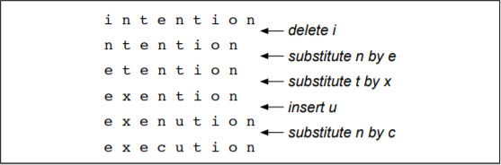
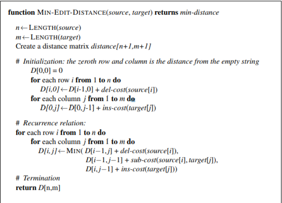
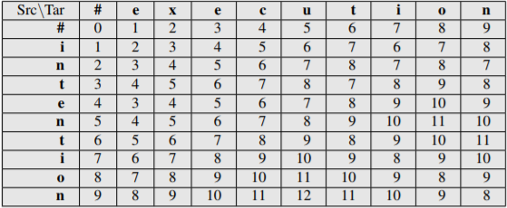
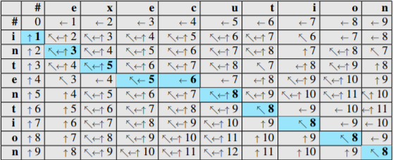

## 2.5最小编辑距离

​	许多自然语言处理都关注于比较两个字符串有多相似。例如，在拼写纠正中，用户键入了一些错误的内容字符串——比如说**graffe**——我们想知道用户想表达什么。用户可能是指一个类似于**graffe**的单词。 在候选的近似词中，**giraffe**与**graffe**只有一个字母不同，似乎很直观地比字母差别更大的**grail**或**graf**更相似。另一个例子是**共指**，判断以下两个字符串是否是指同一实体：

> Stanford President John Hennessy
>
> Stanford University President John Hennessy

再一次，两个字符串非常相似（只有一个词不同）的事实在决定他们是否为共指上似乎是有用的证据。

​	**编辑距离**为我们提供了一种量化这些有关字符串相似性的直觉的方法。 更正式地说，两个字符串之间的**最小编辑距离**定义是，为将一个字符串转换为另一个字符串所需的编辑操作（如插入，删除，替换等）的最小数。

​	举个例子，*intention*与*execution*之间的差距是5（删除i，把n替换为e，把t替换为x，插入c，把n替换为u）。 我们可以通过观察最重要的对字符串距离（两字符串**对齐**）的可视化更容易地看到这一点，如图2.13所示。 给定的两个序列，**对齐**是两个序列的子串之间的对应关系。 因此，我**对齐**空字符串，N和E，依此类推。 在对齐的字符串下面是另一种表达; 用一系列符号表示将上边的字符串转化为下面字符串的**操作列表**：d表示删除，s表示替换，i表示插入。

图2.13最小距离对齐两字符串，最后一行给出了将上边的字符串转化为下面字符串的**操作列表**：d表示删除，s表示替换，i表示插入。

​	我们还可以为每个操作分配特定的花费或权量。这两个序列之间的**Levenshtein**距离是这每个操作花费为1的三个操作最简单的加权因子（Levenshtein，1966）——我们假设一个字母对本身的替换花费成本为零，例如用t代替t。 *intention*与*execution*之间的Levenshtein距离为5。Levenshtein也提出了他的度量标准的替代版本，其中每个插入或删除的成本为1，不允许替换。 （这相当于允许替换，但是给每个替换操作的成本为2，因为任何替换都可以用一次插入和一次删除体现）。在这个版本下， *intention*与*execution*之间的Levenshtein距离是8。

### 	2.5.1最小编辑距离算法

​	如何找到最小编辑距离？我们可以把它视做寻找从一个字符串到另一个字符串的一系列编辑的最短路径的搜索任务。	

图2.14寻找编辑距离视作搜索问题

​	因为所有可能编辑的空间是巨大的，所以我们不能天真地搜索。然而，许多不同的编辑路径将以相同的状态（字符串）结束，因此我们可以只记住每次到达状态的最短路径，而不是重新计算所有这些路径。我们可以通过使用**动态编程**来实现这件事。动态编程是一类算法的名称，由Bellman（1957）首先提出，用将解决方案与子问题相结合的表驱动方法来解决问题。一些自然语言处理中最常用的算法使用动态编程，比如**Viterbi**算法（第8章）和用于解析的**CKY**算法（第11章）。

​	动态编程问题的直觉是大问题可以用正确组合子问题的解决方法来解决。考虑在图2.15展示的字符串*intention*与*execution*的最小编辑距离的最短词的变形路径。

图2.15从*intention*到*execution*的路径

​	想象一下在这条最佳路径（无论它是什么）中的一些字符串（也许是*exention*）。 动态编程的直觉是如果*exention*是否在最优操作列表中，那么最佳序列还必须包括从*intention*到*exention*的最佳路径。 为什么呢？ 如果有一条从*intention*到*exention*更短的路径，那我们可以使用它来替换后得到更短的整体路径，那么之前的最优路径便不再是最优了，这就导致了矛盾。

​	**最短编辑距离**算法虽然叫做Wagner and Fischer (1974)，不过它被许多人独立发现过(见第八章的历史纪录部分)。

​	我们首先来定义两字符串间的最小编辑距离。给出2个字符串，源字符串X的长度为n，目标字符串Y的长度为m，定义D(i,j)为X(1..i)与Y(1..j)的编辑距离，即在X中的第一个i字母与在Y中的的第一个j字母。X与Y的编辑距离即是D(n,m)。

​	我们将使用动态编程将解决方案与子问题相结合,来自下而上的计算D（n，m）。 在基本案例中，源子串长度为i但目标为空字符串，从i字符变为0需要i删除。 目标长度为j的子字符串，从0个字符的空来源到j字符需要j插入。 为小i，j计算D（i，j）后，我们根据先前计算的较小值来计算更大的D（i，j）。D（i，j）的值通过可到达矩阵的三条可能路径的最小值来计算：
$$
D[i,j]=min\left\{
\begin{gather*}
 D[i-1,j]+del-cost(source[i])  \\
 D[i,j-1]+ins-cost(target[j]) \\ 
 D[i-1,j-1]+sub-cost(source[i],target[j]) 
 \end{gather*}
\right.
$$

​	我们假设Levenshtein距离的版本为在插入与删除的操作中每个的成本均为1（ins-cost（·）= del-cost（·）= 1），替换的成本为2（除了同字母的替换为零），D（i，j）的计算为：

$$
D[i,j]=min\left\{
\begin{align}
 &D[i-1,j]+1 \\ 
 &D[i,j-1]+1 \\ 
 D[i-1,j-1]+ \left\{\begin{aligned}2;if source[i]\ne target[j] \\
 0; if source[i]=target[j]\end{aligned}\right.
\end{align}\right.该算法总结在图2.16中;图2.17显示了应用的结果算法与意图和执行之间的距离与版本Levenshtein在Eq。 2.4。
$$

​																	(2.4)

​	该算法总结在图2.16中；图2.17显示了应用 2.4公式版本的Levenshtein算法算出的*intention*与*execution*之间的距离。

​	了解最小编辑距离对于查找潜在的拼写错误更正等算法非常有用。但编辑距离算法在另一个方面也很重要：通过小小的改变，它还可以为对齐两个字符串提供最小的成本。对齐两个字符串在语音和语言处理过程中非常有用。在语音识别中，最小编辑距离对齐被用来计算字错误率（26章）。对齐在句子需要被相互匹配的平行语料库（带有两种语言文本的语料库）的机器翻译中发挥作用。

​	要扩展编辑距离算法以产生对齐，我们可以从将对齐可视化为通过编辑距离矩阵的路径开始。图2.18用粗体单元格显示此路径。每个粗体单元格表示对齐两个字符串中的一对字母。如果两个粗体单元格出现在同一行中，从源到目标将会有插入；两个单元格在同一列中表明删除。

​	图2.18还显示了如何计算对齐路径的直觉。该计算分两步进行。在第一步中，为了将后向指针存储在每个单元格中，我们增强了最小编辑距离算法。从一个单元格到上一个（或一些）单元格的后向指针从我们之前进入目前的单元格中得到。我们在图2.18中展示了这些后项指针的图表。因为最小延伸可能来自多个以前的单元格，有些细胞有多个后向指针。 在第二步中，我们执行了**回溯**。 在回溯中，我们从最后一个单元格（在最后一行和列）开始，根据指针返回动态编程矩阵。 每个完成的从最终单元格到初始单元格的路径均为最小距离对齐。 练习2.7要求您修改最小编辑距离算法以存储指针、计算回溯并输出对齐。

图2.16 最小编辑距离算法，动态类的一个例子编程算法。 各种成本可以固定（例如，∀x，成本（x）= 1）或者可以特定于该字母（以模拟某些字母比其他字母更可能被插入的事实）。 我们假设用一个字母代替自己是没有代价的（即子成本（x，x）= 0）。

图2.17 使用图2.16的算法计算*intention*与*execution*之间的最小编辑距离——插入或删除成本为1，替换成本为2的Levenshtein距离。

​	虽然我们用简单的Levenshtein距离算法来做例子，图2.16中的算法允许操作中的任意权重。例如， 对于拼写纠正，替换更可能发生在键盘上相邻的两个字母之间。 **Viterbi**算法是最小编辑距离的概率扩展。 Viterbi计算从一个字符串到另一个字符串的的“最大概率对齐”，而不是计算两个字符串之间的“最小编辑距离”。我们将在第8章中对此进行更多讨论。

图2.18当在每个单元格中输入值时，我们用最多三个箭头标记我们是从哪三个相邻的单元格而来。表格填满后我们用**回溯**来计算对齐（最小编辑路径），从右下角的**8**开始按箭头后退。 粗体单元格的序列代表两个字符串之间的一种可能的最低成本的对齐。图表于Gusfield（1997）之后设计。

