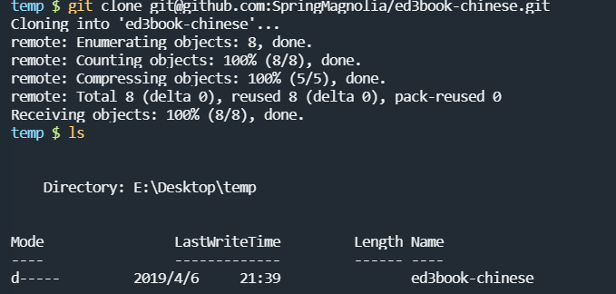
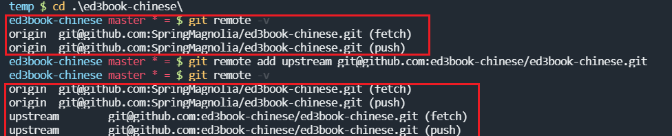
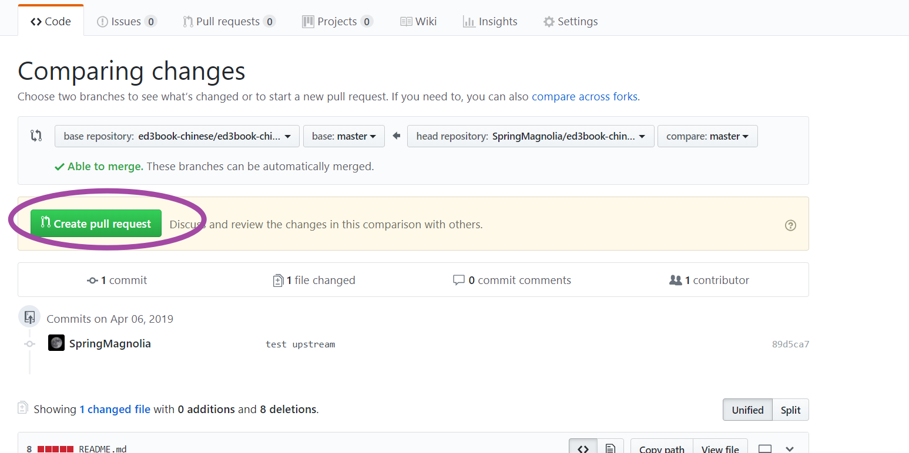
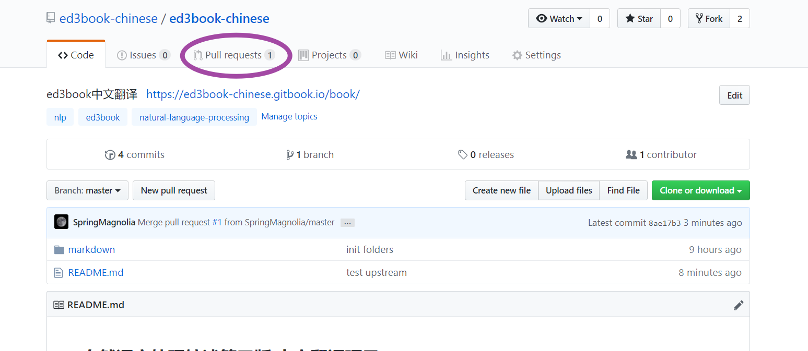
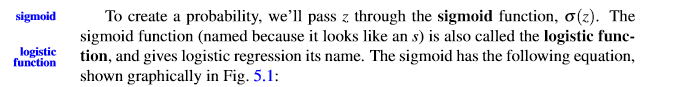
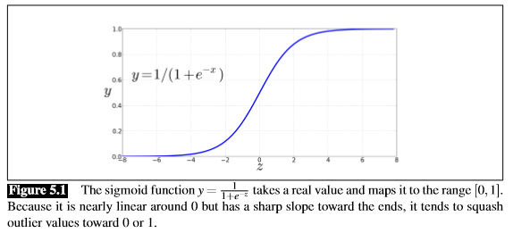
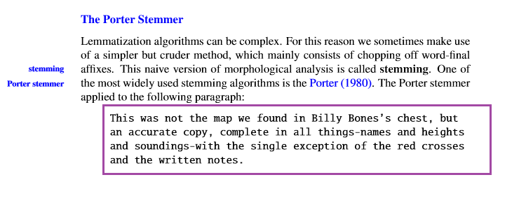
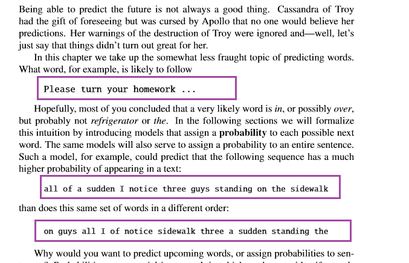
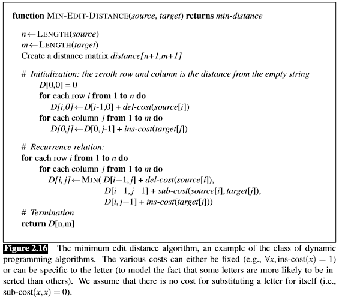

## ed3book翻译格式示例,Version 0.1

### 0. github fork项目和提交自己更新的方法

1. fork项目

2. 克隆自己fork的项目到本地

   

   

3. `git remote -v`观察自己的远程的地址，如果只有`origin的fetch和pull`两个,则添加upstream

   `git remote add upstream git@github.com:slp3-chinese/slp3-chinese.git`

   

   

4. **可以使用下面两个命令，同步远程仓库的内容**

   ```
   git fetch upstream         #fetch upstream 的内容
   git merge upstream/master  #和自己本地的内容进行merge
   ```

   

   

5. 添加自己负责的内容，或者修改，之后 

   ```
   git add 自己修改的文件
   git commit -m "XXX"
   git push origin master  #提交更新到自己github中fork的仓库中
   ```

6. 请求和原始仓库合并，点击`new pull request`

   

   

7. 点击 create pull request

   

   

8. 到此任务结束，即提交合并结束

9. 原来仓库管理员后端可以看到如下内容：

   

   

   


## 1. 标题格式示例

1. 大标题同一使用H1标签，即`# 1. Introduction`
2. 二级标题使用H2标签，即`## 2.1 Regular Expressions`
3. 三级表示使用H3标签，之后同理


### 2. 内容格式示例

#### 2.1. 每章开始的引用不需要翻译

   1. 斜体markdown语法:`*And how do you ...*,或者是<i>文本</i>`

      <div style="text-align: right"> <i>And how do you know that these fine...</i> </div>

      <div style="text-align: right"> <i>The Mysterious Affair at Styles </i></div>

   2. 靠右对齐:`<div style="text-align: right"> your-text-here </div>`

      

#### 2.2 文本格式

   1. 如下图，蓝色字体不翻译，但是需要加黑，即`**sigmoid**`

      

#### 2.3. 图片格式

   1. 图片直接截图，刚好截取方框即可

   2. 截图的描述需要翻译为中文，如下图

      

   3. ```
      > **Figure 5.1** 这个sigmoid函数$y = \frac{1}{1+e^{-z}}$接受一个实数并把它们转化为[0,1]区间...
      ```

   4. 效果如下

      > **Figure 5.1** 这个sigmoid函数$y = \frac{1}{1+e^{-z}}$接受一个实数并把它们转化为[0,1]区间...


#### 2.4. 段落中不需要翻译的内容

段落中的文字资料，可以方法尖括号后，表示引用,即

> This is not the map

如下:




#### 2.5. 算法的伪代码部分,直接截图，Figure 描述需要翻译

   

示例如下：

>  **Figure 2.1.6** 上述的最小编辑距离算法,是一类动态编程算法的的例子....


### 3. latex使用教程

1. 语法表:<http://www.mohu.org/info/symbols/symbols.htm>
2. 在线编辑器：<https://www.codecogs.com/latex/eqneditor.php>